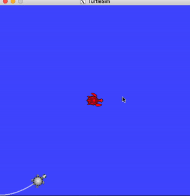

To launch

```
catkin make
source devel/setup.bash
cd ..
roslaunch hw3 run.launch
```
To run in docker on Mac OS follow [this](https://desertbot.io/blog/ros-turtlesim-beginners-guide-mac) guide (use ros:melodic image) 

